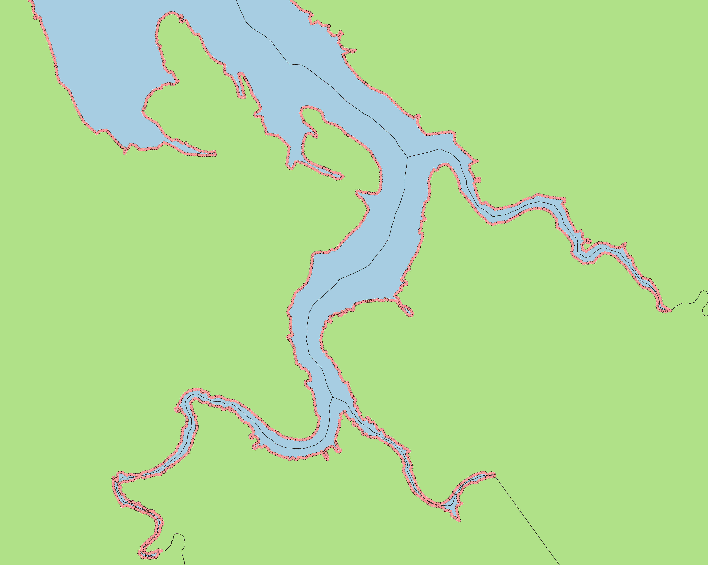
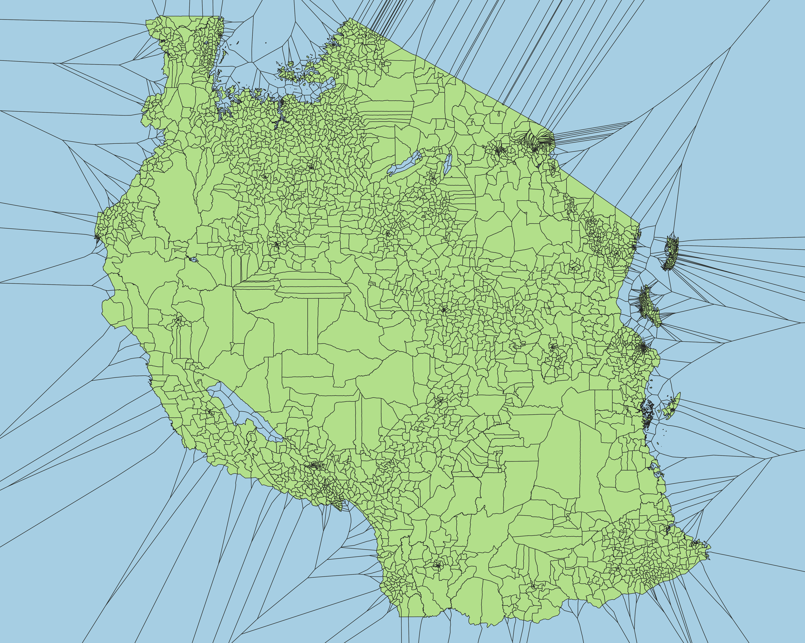

# Polygon to Voronoi

This tool takes polygons as inputs and applies a voronoi algorithm along the edges, giving results similar to a euclidean allocation distance raster. Unlike euclidean allocation, the source is never transformed from vector to raster. All internal polygon topology remains unchanged, with the exception of internal holes which are filled in the same way the exterior is filled out.

## Usage

Currently, supported inputs are polygon layers in GeoPackage (.gpkg), Shapefile (.shp), or GeoJSON (.geojson) formats. For GeoPackages, all polygon layers inside are processed. Outputs retain their original format, projected to EPSG:4326 (WGS84). To get started, add files to the `inputs` directory, where they're processed in parallel into `outputs`. Make sure docker is installed and running, and run `docker-compose up`. For those on Linux or macOS who want to process outside of docker for more native performance, install GDAL and PostGIS with a polygon_voronoi table. After that, run `python3 -m processing` from this directory.

## Configuration

There are three user configurable variables defined in `config.ini`. The first is a `dissolve` field. By default, this is set to `fid` which doesn't dissolve the output. This field is the default primary ID for GeoPackages, and is automatically added to Shapefiles and GeoJSON if missing. The second option is a `precision` value, set to `0.0001` by default. This decimal degree value is equivalent to roughly ~10m, and is used as the interval points are set along the edges for the voronoi algorithm. This value is chosen to be similar to the resolution of satellite imagery, which is sometimes used to digitize vector boundaries along shorelines. For planet level geometry, a smaller precision (`0.01`) helps the algorithm run faster and use less memory. For smaller areas, a higher precision (`0.000001`) ensures the allocation is as accurate as possible, but takes longer and may fail if there is insufficient system memory. The final valiable is for `snap`, which fixes the precision of points generated along the edges to account for errors caused by spurious precision in geometries. This should rarely be changed, and is set to a default of `0.000001` (approx 0.1m) that works for most inputs tested. Reducing the precision of this value does not help the algorithm run faster, and should only be adjusted for debugging. Note that snapping only occurs for points to generate voronoi polygons. Internal polygon boundaries are unaffected by this and maintain original precision.

## How it Works

The overall processing can be broken down into 4 distinct types of geometry transformations:

- polygon to lines
- lines to points
- points to voronoi
- merge polygon with voronoi

### Polygon to Line

The first part extracts outlines from the polygon, first by dissolving all polygons together, then by taking the intersection between the line boundary in the oriignal and dissolved layers.

|   Original Input    |      Outlines       |
| :-----------------: | :-----------------: |
|  |  |

### Lines to Points

| Points along River  |    Final result     |
| :-----------------: | :-----------------: |
|  |  |

### Points to Voronoi

| Points with Voronoi |    Voronoi Only     |
| :-----------------: | :-----------------: |
|  |  |

### Merge Polygon with Voronoi

| Original over Voronoi |   Dissolved Layer   |
| :-------------------: | :-----------------: |
|    |  |

## Use Case 1: Matching sub-national boundary (ADM3) to national (ADM0)

|  ADM0 over Voronoi  | Original vs ADM0 edges |
| :-----------------: | :--------------------: |
|  |     |

## Known Issues

Vector inputs created from raster sources are known to present issues in rare cases. In the PostGIS implementation of voronoi polygons, inputs in a regular grid can sometimes result in polygon outputs with invalid geometry, giving one of the following errors:

- lwgeom_unaryunion_prec: GEOS Error: TopologyException: unable to assign free hole to a shell
- GEOSVoronoiDiagram: TopologyException: Input geom 1 is invalid: Self-intersection
- processing.voronoi runs at 300% CPU for more than 15 min

The default snapping threshold in the config addresses this in most cases. However, if this occurs, first try reducing the segment precision to a value that generates valid outputs. If this still doesn't work after reducing precision to a value of 1, alternatively try reducing the snap precision as well.

| Possible Error (segment=0.0001) | Succeeds (segment=0.0003) |
| :-----------------------------: | :-----------------------: |
|              |        |
