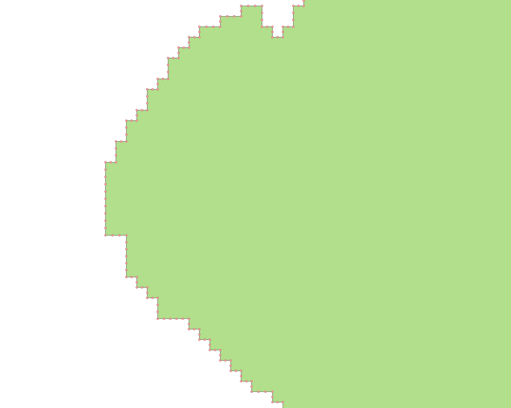

# Polygon to Voronoi

This tool takes polygons as inputs and applies a voronoi algorithm along the edges, giving results similar to a euclidean allocation distance raster. Unlike euclidean allocation, the source is never transformed from vector to raster. All internal polygon topology remains unchanged, with the exception of internal holes which are filled in the same way the exterior is filled out.

## Supported Formats

Currently, supported inputs are polygons in GeoPackage (.gpkg), Shapefile (.shp), or GeoJSON (.geojson) formats. For GeoPackages, all polygon layers inside are processed. Outputs retain their original format, projected to EPSG:4326 (WGS84).

## Usage

The only requirements are to download [this repository](https://github.com/fieldmaps/polygon-voronoi/archive/refs/heads/main.zip) and install [Docker Desktop](https://www.docker.com/products/docker-desktop). Add files to the included `inputs` directory, where they'll be processed to the `outputs` directory. Make sure Docker Desktop is open, and run `docker-compose up` from the command line in this directory to initiate the conversion. Polygons the size of small countries typically take a few minutes, with larger ones taking upwards of 30 min using default settings. Processing time is proportional to total perimeter length rather than area.

## Configuration

There are three user configurable variables defined in `config.ini`. These don't need to be changed to get started, they're configured to be immediately usable. The first is a `dissolve` field. By default, this is set to `fid` which doesn't dissolve the output. This field is the default primary ID for GeoPackages, and is automatically added to Shapefiles and GeoJSON if missing. The second option is a `segment` value, set to `0.0001` (approx. 10m) by default. This is used as the distance interval points are set along lines for the voronoi algorithm. The value was chosen to be similar to satellite imagery resolution, which is sometimes used for automatically digitizing shorelines. For planet level geometry, a smaller precision (0.001) helps the algorithm run faster and use less memory. For smaller areas, a higher precision (0.00001) ensures the allocation is as accurate as possible, but takes longer and may fail if there is insufficient system memory. The final variable is for `snap`, which fixes the points generated along the edges to a grid to account for internal errors caused by spurious precision in geometries. This should rarely be changed, and is set to a default of `0.000001` (approx. 0.1m), providing a good trade-off between speed and accuracy for most inputs. Note that snapping only occurs for points used to generate voronoi polygons. Internal polygon boundaries are unaffected by this and maintain original precision.

## How it Works

The overall processing can be broken down into 4 distinct types of geometry transformations:

- make lines from polygons
- make points from lines
- make voronoi from points
- merge polygons with voronoi

**Polygon to Line:** The first part extracts outlines from the polygon, first by dissolving all polygons together, then by taking the intersection between the outline of the dissolved and the original layer. By intersecting these two together, it retains attribute information of where segments originate from.

|   Original Input    |      Outlines       |
| :-----------------: | :-----------------: |
|  |  |

**Line to Point:** Lines are converted to points using two methods. The first set of points are taken from all vertices that make up a line. However, for certain areas like winding rivers and deltas, this in an insufficient level of detail to properly center the resulting voronoi. With just vertices, the center lines would zigzag through gaps instead of going straight through them. Lines are therefore split up into segments based on a configurable distance, with points taken at the breaks between segments.

| Points along River  | Final Result along Delta |
| :-----------------: | :----------------------: |
|  |       |

**Point to Voronoi:** For country sized inputs, there may be hundreds of thousands, if not millions of individual voronoi polygons created in this step. Because each individual section retains attribute information of what polygon it originated from, they can be dissolved together to a simplified output.

| Points with Voronoi |    Voronoi Only     |
| :-----------------: | :-----------------: |
|  |  |

**Polygon-Voronoi Merge:** The original polygon is overlayed in a union with the voronoi. Boundaries from the inner area are kept from the original, dissolved with polygons containing matching attributes from the outside area. The dissolved layer is the final output of the tool.

| Original over Voronoi |    Final Output     |
| :-------------------: | :-----------------: |
|    |  |

## Use Case 1: Matching sub-national boundary (ADM3) to national (ADM0)

One original use case for this tool was resolving edge differences between different levels of administrative boundaries, where some layers included water bodies but others did not. The United Republic of Tanzania is used in this example as it contains many elements that have been difficult to resolve in the past: lakes along international boundaries, internal water bodies shared by multiple areas, groups of islands, etc. The diagram on the left shows how the ADM3 layer would appear in a global edge-matched geodatabase. The diagram on the right shows how water areas are allocated compared to the original.

|  ADM0 over Voronoi  | Original vs ADM0 edges |
| :-----------------: | :--------------------: |
|  |     |

## Use Case 2: Topologically clean international boundaries

The other original use case envisioned for this tool is resolving edges between boundaries where there are significant gaps or overlaps. Where this occurs, a separate topologically clean layer is required to set boundary lines, after which the process is similar to the above.

| Topologically clean ADM0 with areas of interest |
| :---------------------------------------------: |
|                              |

| Original boundaries | Clipped voronoi boundaries |
| :-----------------: | :------------------------: |
|  |         |

| Original boundaries (tri-point) | Clipped voronoi boundaries (tri-point) |
| :-----------------------------: | :------------------------------------: |
|              |                     |

## Use Case 3: Improving coastlines

The use case above demonstrates how useful it is to have a topologically clean global ADM0 layer. Few portray disputed areas properly, and for those that do have accurate internal boundaries, coastlines may lack in detail compared to other sources. OpenStreetMap has very detailed coastline data available as Shapefiles, and this can be integrated with ADM0 datasets in the same way as above.

| World ADM0 with Voronoi |    Voronoi Only     |
| :---------------------: | :-----------------: |
|      |  |

|    Original ADM0    | Coastline replaced with OSM |
| :-----------------: | :-------------------------: |
|  |          |

## Potential Issues

In earlier versions of this tool, vector inputs created from raster sources were known to present issues in rare cases. In the PostGIS implementation of voronoi polygons, inputs in a regular grid can sometimes result in polygon outputs with invalid geometry, giving one of the following errors:

- lwgeom_unaryunion_prec: GEOS Error: TopologyException: unable to assign free hole to a shell
- GEOSVoronoiDiagram: TopologyException: Input geom 1 is invalid: Self-intersection
- processing.voronoi runs at 300% CPU for more than 30 min

Significant effort has been taken to prevent this from occurring in current versions of this tool. However, if this does occur, first try reducing the segment precision to a value that generates valid outputs, a value of 0.0003 usually works. If this still doesn't work after reducing precision even further, trying to reduce the snap precision should help too. If still failing, the issue may be related to topological errors in the original input. It may need to be cleaned before processing, as only basic validity checks are done on import.

| Possible Error (segment=0.0001) | Succeeds (segment=0.0003) |
| :-----------------------------: | :-----------------------: |
|              |        |
